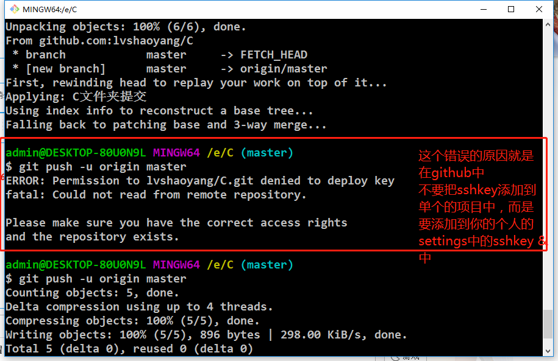

# sort
记录常用的一些排序

自己可以参考网上的资料，大致可以理解并且写出来

```
参考网址
https://mp.weixin.qq.com/s/9WSCS1rgMuf5tXIALRLFfw
```
 各个算法的时间复杂度
 
 .png "O(N)")

2018年8月15日16:2:8

###和GitHub关联的步骤：
```
1、本地使用idea写完代码后，在工作空间下，执行git init命令
2、在GitHub上创建一个repository,可得到git@github.com:lvshaoyang/sort.git这样的一个git
3、在本地使用命令添加git remote add origin git@github.com:lvshaoyang/sort.git，进行关联
4、在本地的idea中配置github.com,使用用户名和密码方式
5、在github上提示是否创建readme.md文件，然后我就创建了，然后问题来了

```
问题记录：
```
1、在以上步骤进行完之后，准备使用git push提交，但是提示失败。
    To github.com:lvshaoyang/sort.git
    ! [rejected]        master -> master (non-fast-forward)
    error: failed to push some refs to 'git@github.com:lvshaoyang/sort.git'
然后git pull的时候提示有unrelated histories
使用git pull -- allow-unrelated-histories也不行

后来搜索得知
$ git push -u origin master

To git@github.com:yangchao0718/cocos2d.git

 ! [rejected]        master -> master (non-fast-forward)

error: failed to push some refs to 'git@github.com:yangchao0718/cocos2d.git

hint: Updates were rejected because the tip of your current branch is behin

hint: its remote counterpart. Integrate the remote changes (e.g.

hint: 'git pull ...') before pushing again.

出现错误的主要原因是github中的README.md文件不在本地代码目录中

可以通过如下命令进行代码合并【注：pull=fetch+merge]

git pull --rebase origin master

执行上面代码后可以看到本地代码库中多了README.md文件

此时再执行语句 git push -u origin master即可完成代码上传到github

```

关于关联本地和github仓库时，推送权限的问题的备注：
 
```
```


